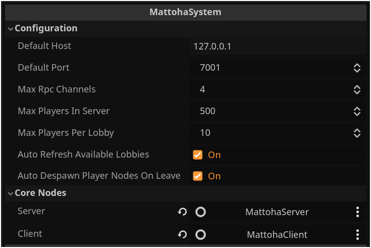
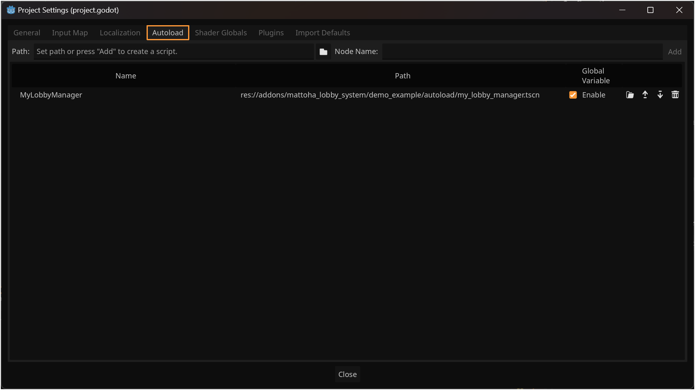
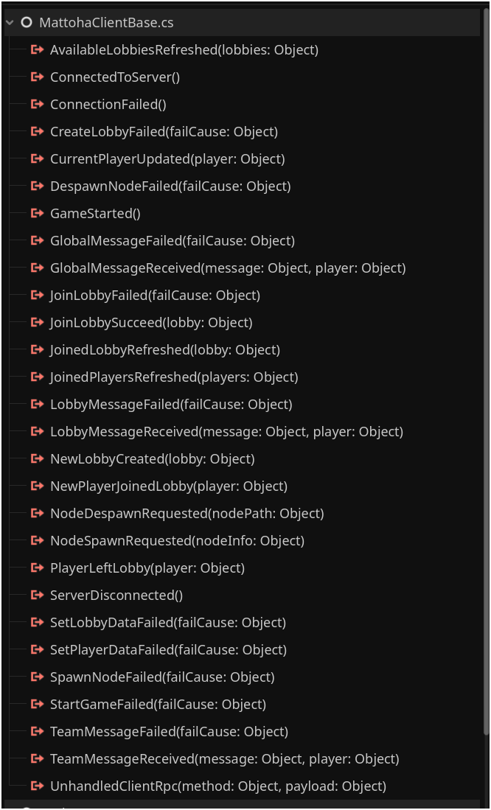
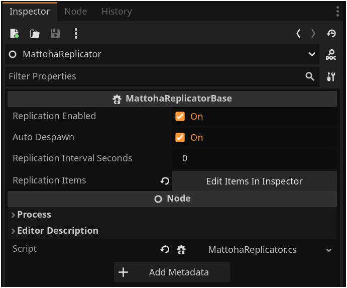
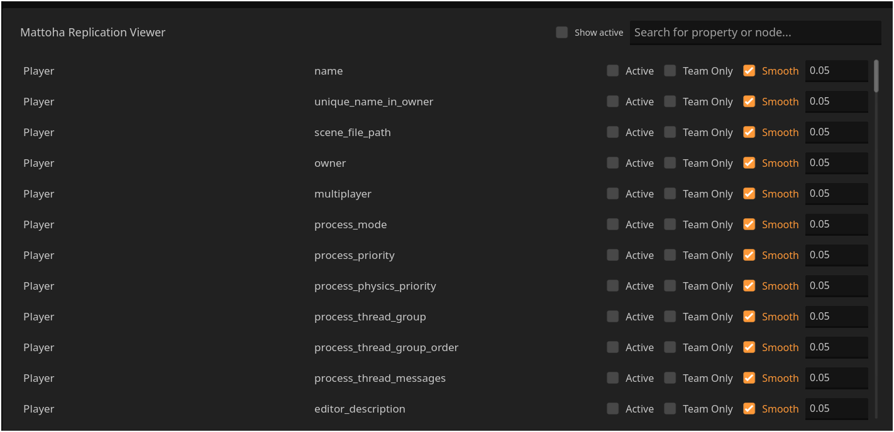

( !! Pray for Gaza / Israeli occupation is doing genocide against Innocent Gaza People and children !!)


# Multi-Lobby System for Godot Engine (C#)

Mattoha Lobby System is an addon designed to simplify multiplayer game development in Godot using C#! This addon offers a robust framework for managing multiple lobbies with a single server instance, allowing for dynamic and engaging multiplayer experiences.

## Features:

- **Multi-Lobby Management:** Easily create and manage multiple lobbies within your game.
- **Centralized Server:** Streamline server management with a single server instance for all lobbies.
- **Auto Replication:** Ensure consistency between clients with automatic data replication.
- **Dynamic Spawning:** Seamlessly spawn and manage game entities within each lobby.
- **Easy Integration:** Designed for C# developers with a user-friendly API.
- **Extensibility:** Customize and extend functionality to suit your game's needs.
- **ServerMiddleware:** customize your Before & After almost all server events.
- **UnhandledRpc:** MattohaLobbySystem allows you to send a custom RPC and handle it at your own, for both client & server.


## Have any ideas ?
DM me on X-platform - https://x.com/zer0xtj , It would be appreciated if you write in Arabic.

## Donation
Buy me a cofee - https://www.buymeacoffee.com/zer0xtj

## Requirements
- Godot Engine .NET 4.2+
- Visual Studio Community 2022


## Installation
- You can download the source code and copy/paste the addon to your godot addons folder, then enable it from plugin tab in your project settings
- Or you can download it from asset lib in godot engine

## Usage
There is an example that comes with MattohaLobbySystem Addon , you can discover it on your own, or you can watch a youtube video .
- Youtube [ English ] :
- Youtube [ Arabic ] :

## Main Concepts
before we start, configure your .csproject to be similar to this:
```xml
<Project Sdk="Godot.NET.Sdk/4.2.2">
  <PropertyGroup>
    <TargetFramework>net6.0</TargetFramework>
    <TargetFramework Condition=" '$(GodotTargetPlatform)' == 'android' ">net7.0</TargetFramework>
    <TargetFramework Condition=" '$(GodotTargetPlatform)' == 'ios' ">net8.0</TargetFramework>
    <EnableDynamicLoading>true</EnableDynamicLoading>
    <Nullable>enable</Nullable>
  </PropertyGroup>
  <PropertyGroup Condition="'$(Configuration)|$(Platform)'=='Debug|AnyCPU'">
    <DefineConstants>$(DefineConstants);MATTOHA_SERVER;MATTOHA_CLIENT</DefineConstants>
  </PropertyGroup>
  <PropertyGroup Condition="'$(Configuration)|$(Platform)'=='ExportRelease|AnyCPU'">
    <DefineConstants>$(DefineConstants);MATTOHA_CLIENT,MATTOHA_SERVER</DefineConstants>
  </PropertyGroup>
</Project>
```
When you want to distrubite your game for players, disable `MATTOHA_SERVER` constant and keep `MATTOHA_CLIENT`, this will protect your server side code.
This configuration will help you to debug your code easly.

After Enabling The addon on your project, Create a new node and call it whatever you want.
then attach a C# script to it and call it `MyLobbyManager` - as name of the class, class snippet :
```Csharp
public partial class MyLobbyManager : Node
{
	public static MattohaSystem? System { get; private set; }

	public override void _EnterTree()
	{
#if MATTOHA_SERVER
		GD.Print("#Is MATTOHA_SERVER : true");
#endif
#if MATTOHA_CLIENT
		GD.Print("#Is MATTOHA_CLIENT : true");
#endif
		System = (MattohaSystem)GetNode("MattohaSystem");
		base._EnterTree();
	}
}
```

Now compile your code, and add a child node of type `MattohaSystem`, you will find this node when you enable MattohaLobbySystem addon, we didn't finished yet, 
now we want 2 children for our `MattohaSystem` node, we need `MattohaServer` & `MattohaClient` nodes as sibling nodes under `MattohaSystem` go ahead and add them.
Your tree would be something like this;
```
- MyLobbyManager
  - MattohaSystem
    - MattohaClient
    - MattohaServer
```
Now, from inspector, edit MattohaSystem proeprties and assign `Server` & `Client` nodes to it.
You can also configure the system proeprties like `IP`, `PORT`, `MaxPlayersPerLobby` etc .



Last but not least, go ahead and add this scene to autoload in your project settings.



After this setup, we are ready to use the functionality of our MattohaLobbySystem!, you can access all public function on server and client nodes.

- Examples:
```csharp
// start server
MyLobbyManager.System.Server.StartServer()

// connect client to server
MyLobbyManager.System.Client.ConnectToServer()

// we also can listen to nodes signal from codes
MyLobbyManager.System.Client.ConnectedToServer += OnConnectedToServer;
```

- We also can listen to signals from godot engine user interface:




| Signal Name                       | Description                                                                                          |
|-----------------------------------|------------------------------------------------------------------------------------------------------|
| ConnectedToServer                 | Emmited when a connection to server is succeed.                                                      |
| ConnectionFailed                  | Emmited when a connection to server failed.                                                          |
| ServerDisconnected                | Emmited when server disconnected.                                                                    |
| CurrentPlayerUpdated              | Emmited when current player data is updated.                                                         |
| NewLobbyCreated                   | Emmited when a new lobby is created successfully.                                                    |
| AvailableLobbiesRefreshed         | Emmited when the list of available lobbies is updated.                                                |
| JoinLobbySucceed                  | Emmited when joining to lobby succeeed.                                                               |
| NewPlayerJoinedLobby              | Emmited when new player joined current lobby.                                                         |
| JoinedLobbyRefreshed              | Emmited when joined lobby is updated.                                                                 |
| JoinedPlayersRefreshed            | Emmited when joined players list in lobby is updated.                                                 |
| TeamMessageReceived               | Emmited when a new team message is received.                                                         |
| LobbyMessageReceived              | Emmited when a new lobby message is received.                                                        |
| GlobalMessageReceived             | Emmited when a new global message is received.                                                        |
| GameStarted                       | Emmited when joined lobby game started.                                                               |
| PlayerLeftLobby                   | Emmited when a player left a lobby.                                                                   |
| NodeSpawnRequested                | Emmited when a new node should be spawned.                                                            |
| NodeDespawnRequested              | Emmited when a node should be despawned.                                                              |
| JoinLobbyFailed                   | Emmited when joining to lobby failed.                                                                 |
| SetPlayerDataFailed               | Emmited when setting player data fail.                                                                |
| CreateLobbyFailed                 | Emmited when creating lobby failed.                                                                   |
| SetLobbyDataFailed                | Emmited when setting lobby data fail.                                                                 |
| TeamMessageFailed                 | Emmited when sending team message fail.                                                               |
| LobbyMessageFailed                | Emmited when sending lobby message fail.                                                              |
| GlobalMessageFailed               | Emmited when sending global message fail.                                                             |
| StartGameFailed                   | Emmited when starting lobby game fail.                                                                |
| SpawnNodeFailed                   | Emmited when spawning a node fail.                                                                    |
| DespawnNodeFailed                 | Emmited when despawning a node fail.                                                                  |
| UnhandledClientRpc                | Emmited when a server called unhandled RPC.                                                           |


when you create a game scene, you need to add important nodes, `MattohaSpawnListener` the one responisble for spawning & despawning nodes for other players,
and `MattohaReplicateListener` the node responsible for replicate some node data for other players in same lobby.
you dont need to configure them, adding them will do the job.


the last node for client is `MattohaReplicator` node, its the node responsible for sending node data for other players in same lobby

lets assume that we have a player node called `Player`, and has a child `Sprite2D`, in this case, we need to replicate the player position and the `Modulate` of the sprite,

we cann add `MattohaReplicator` node to the `Player` node, this node has a fiew but important properties.



we can enable or disable the replication, 
and we can set auto despawn to true , this will despawn the node for all players when a node exit the tree.
also there is an important button `Edit Items In Inspector`, here we can select the properties we need to replicate over network for other players in same lobby


when we press that button, we will see the bottom panel Replication Viewer



We can select properties that we want to replicate, and we can select if we want the replication to be applied smoothly or not, also we can select the smooth time, and specify this replication if it's team only or for all lobby players.

`NOTE: press Ctrl+S whenever change any replication data`

MattohaClient Methods to interact with server:

| Method              | Description                                              |            Signal(s) Emmited (success or fail)             |
----------------------|----------------------------------------------------------|------------------------------------------------------------|
| GetCurrentPlayerData | Get current player object casted to concrete type instead of JsonObject. | |
| GetCurrentLobbyData | Get current lobby object casted to concrete type instead of JsonObject. | |
| GetJoinedPlayers | Return list of joined players casted to concrete type instead of List<JsonObject>. | |
| ConnectToServer | Connect to server. | ConnectedToServer / ConnectionFailed |
| SetPlayerData | Set or register player data on server, NOTE that: Id, JoindLobbyId cant be set. | CurrentPlayerUpdated / SetPlayerDataFailed
| CreateLobby | Create a new lobby, then join it. | NewLobbyCreated / CreateLobbyFailed |
| LoadAvailableLobbies | Load available lobbies, when done, a signal will be emmited. | AvailableLobbiesRefreshed |
| JoinLobby | Join loby by it's Id. | JoinLobby / JoinLobbyFailed |
| RefreshJoinedLobby | Refresh joined lobby data and fetch the data from server. | JoinedLobbyRefreshed |
| RefreshJoinedPlayers | Refresh joined players in lobby. | JoinedPlayersRefreshed |
| SetLobbyData | Update Joined Lobby data (only owner can update it), note that Id, PlayersCount & IsGameStarted cant be updated. | JoinedLobbyRefreshed / SetLobbyDataFailed | 
| SendTeamMessage | Send a team message. | TeamMessageReceived / TeamMessageFailed |
| SendLobbyMessage | Send a lobby message. | LobbyMessageReceived / LobbyMessageFailed  |
| SendGlobalMessage | Send a global message. | GlobalMessageReceived / GlobalMessageFailed |
| StartGame | Start joined lobby game, only owner can start games. | GameStarted / StartGameFailed |
| LeaveLobby | Leave joined lobby | PlayerLeftLobby (for remaining players in lobby ) |
| SpawnNode | Spawn a node for players in joined lobby. | NodeSpawnRequested / SpawnNodeFailed |
| SpawnAvailableNodes | Spawn nodes that already spawned from other players, use this method when a new player join the game scene. | NodeSpawnRequested(foreach node) |
| DespawnNode | Despawn node on players's devices, player can despawn nodes he owns only. | NodeDespawnRequested / DespawnNodeFailed |
| SendUnhandledServerRpc | Send a custom method name RPC to server to execute, this will emmit "UnhandledRpc" signal on server node. | UnhandledServerRpc (On Server Node)  |


This was the main nodes for client, but wait , what if we want to customize our server side codes?, what if we want to block player from edit his data? what if we want to connect to our database ?

Well, this is why MattohaLobbySystem is powerfull, it comes with a node called `ServerMiddleware`, You can create your own ServerMiddleware for sure to customize your server logic before & after almost all events.

## Custom Server Middleware
To create your custom Server middleware, go to MyLobbyManager scene, and under `MattohaClient`, add new node.
Now attach a new script and call it `CustomServerMiddleware` the class snippet as following :
```csharp
public partial class CustomServerMiddleware : MattohaServerMiddleware
{
#if MATTOHA_SERVER
	public override MattohaMiddlewareResponse BeforeSetPlayerData(MattohaServerBase server, JsonObject player)
	{
		GD.Print("Doing some logic on custom middleware");
		return new MattohaMiddlewareResponse
		{
			Status = false,
			Messsage = "Some error message"
		};
	}
#endif
}
```
We override a method called `BeforeSetPlayerData`, this method will return `MattohaMiddlewareResponse` object with a status propery, if status is `true` then the execution will continue, otherwise, the execution will not, and FailSignal will be emmited on client node with a `Message` error, the signal emmited depends on the method that returned `false` status.

Now select `MattohaServer` node and assign your custom MiddlewareNode to `Server Middleware` property.

The following table describe the middleware methods that you can use to customiae your server side logic:

| Method              | Description                                              |
----------------------|----------------------------------------------------------|
| BeforeSetPlayerData | Executes before setting player data. |
| AfterSetPlayerData | Executes after setting player data. |
| BeforeCreateLobby | Executes before createing lobby. |
| AfterCreateLobby | Executes after create lobby. |
| BeforeJoinLobby | Executes before a player join a lobby. |
| AfterJoinLobby | Executes after a player joined a lobby. |
| BeforeSetLobbyData | Executes before setting lobby data by owner. |
| AfterSetLobbyData | Executes after lobby data being set. |
| BeforeSendTeamMessage | Executes before sending a team message. |
| AfterSendTeamMessage | Executes after a team message sent. |
| BeforeSendLobbyMessage | Executes before sending a lobby message. |
| AfterSendLobbyMessage | Executes after a lobby message sent. |
| BeforeSendGlobalMessage | Executes before sending a global message. |
| AfterSendGlobalMessage | Executes after a global message sent. |
| BeforeStartGame | Executes before starting lobby game. |
| AfterStartGame | Executes after starting the game. |
| BeforePlayerLeaveLobby | Executes before player leave lobby. |
| AfterPlayerLeaveLobby | Executes after player leave lobby. |
| BeforeSpawnNode | Executes before spawning a node. |
| AfterSpawnNode | Executes after spawning a node. |
| BeforeDespawnNode | Executes before despawning a node. | 
| AfterDespawnNode | Executes after despawning a node. |


The following table describe the server side methods :
| Method              | Description                                              |
----------------------|----------------------------------------------------------|
| SendUnhandledClientRpc | Send a custom method name RPC to client to execute, this will emmit "UnhandledRpc" signal on client node. | 
| GetPlayers | Get Players dictionary, but cast it to custom concrete objects instead of JsonObject, where key is the id of player, and the value is the player object. |
| GetLobbies | Get lobbies dictionary, but cast it to custom concrete objects instead of JsonObject, where key is the id of lobby, and the value is the lobby object. |
| GetPlayer | Get Player from players dictionary but casted to custom type. |
| GetLobby | Get Lobby from lobbies dictionary but casted to custom type. |
| GetPlayersInLobby | Get List of players joined in lobby. |
| GetLobbyOfPlayer | Get the joined lobby from player id. |
| StartServer | Start the server session. |
| RefreshAvailableLobbiesForAll | Send available lobbies for all players. |
| RefreshJoinedLobbyForPlayer | Refresh joined lobby for a specific player. |
| RefreshJoinedLobbyForAll | Refresh joined lobby for all players joined. |
| RefreshJoinedPlayersForPlayer | Send the joined players list to a specific player. |
| RefreshJoinedPlayersForAll | Send the joined players list to a all players in specific lobby. |
| RefreshLobbyDataForAllJoinedPlayers | Refresh Lobby data for all joined players in the lobby. |
| SendTeamMessage | Send a message for all players in same lobby and same team. |
| SendLobbyMessage | Send a message for all players in same lobby. |
| SendGlobalMessage | Send a message for all online players. |
| DespawnPlayerNodes | Despawn player nodes from his current joined lobby. |
| RemovePlayerFromJoinedLobby | Remove player from joined lobby. |
| SendUnhandledClientRpc | Send a custom method name RPC to client to execute, this will emmit "UnhandledClientRpc" signal on client node. |


# TODO:
- ADD an option to replicator to set "despawn" type to => server / direct peers
- GDScript binding
